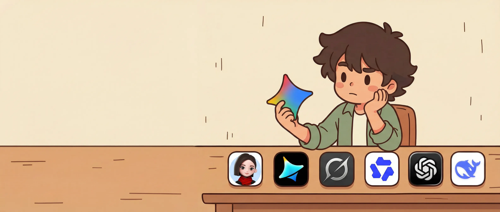

  

# 水的离子积 / Kevin

### Building in AI Era

AI 产品实践者 · 自媒体博主 · 持续构建者  
AI product practitioner · content creator · builder

  <a href="https://www.kw-aigc.cn"> 个人网站</a> ·
  <a href="https://mp.weixin.qq.com/s/7ME2FZdOVlEmVxlGE1NqsQ"> 公众号</a> ·
  <a href="https://www.xiaohongshu.com/user/profile/642c383e000000001001e9e4"> 小红书</a>

  
  
  
  
  
  

## 关于我 / About

我关注 AI 产品、Agent workflow、自动化工具链与个人知识系统，持续把实践沉淀为可复用的方法与内容。  
I focus on AI products, agent workflows, automation toolchains, and personal knowledge systems—turning practice into reusable methods and content.

## Focus

- AI 产品方法与原型设计 / AI product thinking & prototyping
- Agent workflow / OpenClaw / automation
- Obsidian / LLM Wiki / personal knowledge systems
- 内容写作与实践复盘 / writing from hands-on practice

## 技术栈 / Tech Stack

### Product & AI

### Engineering

### Automation & Knowledge

### Building Style

## GitHub Stats

  
  

## Contact

- WeChat: `kwaigc`

> 把工具跑进工作流，把实践沉淀成系统。  
> Turn tools into workflows, and turn practice into systems.
